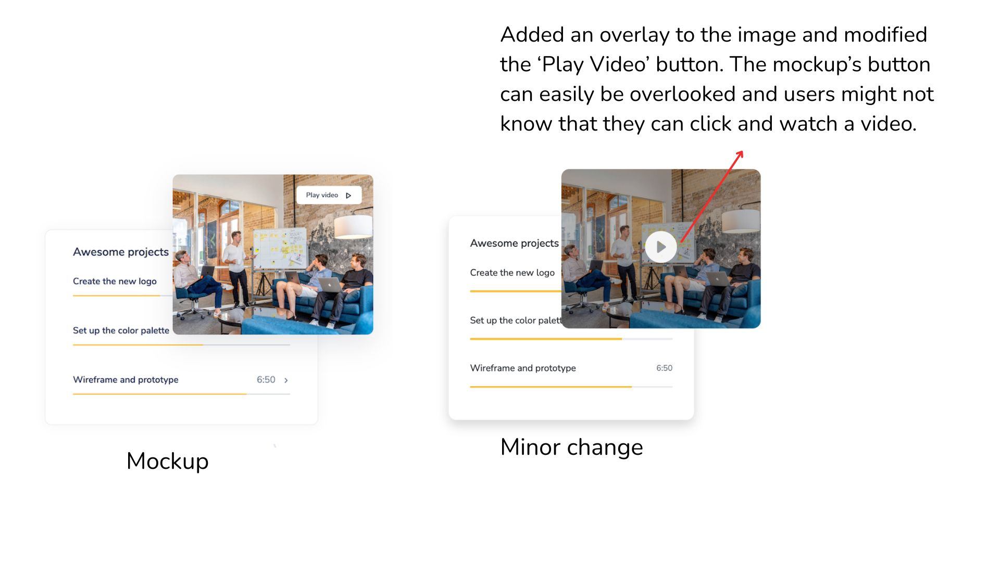
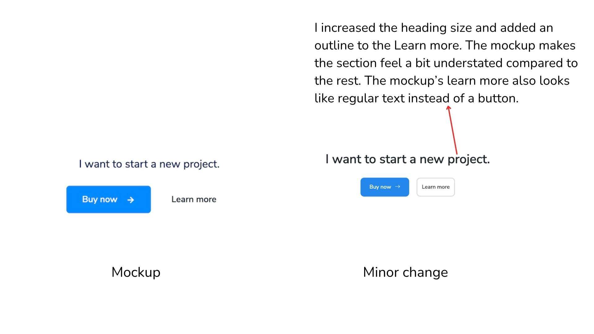
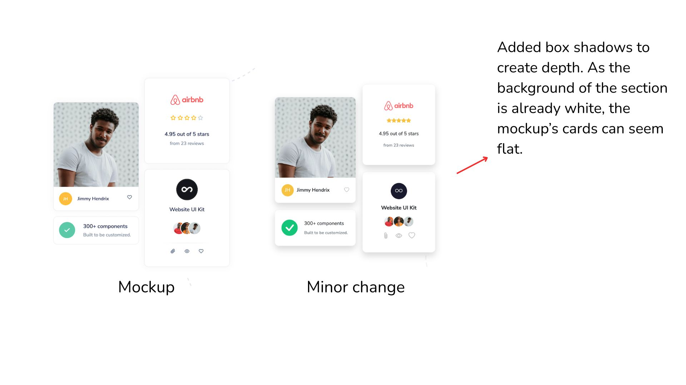
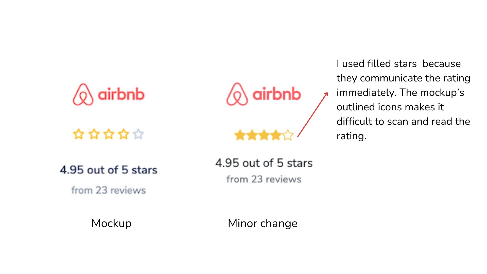

# Mockup Design Notes & Comments

Hi Odoo team! Below are some of my observations on the mockup provided.

---

## What I Find Good

### Strong Hero Section with a Clear Call-to-action
- Visual hierarchy is clear: bold headline, supporting description, and a CTA button. The credit card mockup also adds visual interest so its not all text.

### Effective Content Flow
- I like the alternating layout across the Tools, Features, and Technology section. It makes it feel like there is a flow that keeps the user scrolling.
- The stacked cards on the tools and technology features also give a good depth.

### Emphasis on Service/Product Credibility
- The "Trusted by" in the Hero and Awards section reinforces credibility towards the product. Although their purpose is similar, having them at different points makes sense: the first builds initial trust then the other supports it after scrolling through the feature/tools/technology section.

### Diagonal Clip-paths
- The angled edges in the hero, awards, and footer give the page a dynamic look so it does not look too generic.

### White Space
- The mockup has decent spacing between most of the sections so it does not feel cluttered or tight.

---

## What I Would Change and Improve

### "I Want to Start a New Project" Section Can Easily Be Overlooked
- This section does not have enough space and it feels cramped and empty. The "Learn more" button is also styled like normal text which can confuse users into thinking it's not a button.
- To improve this, I would consider adding a different background color or increasing the heading size.

### Play Video Button Blends Into the Images
- The white button blends into the content. Adding a semi-transparent dark overlay, changing the button's color/border, or changing the button's position could make the video content more obvious.

### Typography Inconsistencies
- Heading sizes and weights feel inconsistent. For example, in the features section and awards section, the mockup's heading looks like an h3 but on the other sections like the technology and tools use h2.

### Section Badges Are Confusing
- Combining a heading with a pill badge feels redundant. If we look at the heading "We build for designers…" it already tells you what it's about. The color system also feels random, it is confusing why Awards and Technology would be the same color blue.

### CTA Language Consistency
- The mockup uses "Buy now" in the navigation bar and "Purchase now" in the footer. Although the words mean the same thing, I think picking one term for the same action keeps the messaging clear and consistent.

### Color Contrast Concern
- The Infinite Solutions and footer's background is too dark for the white text. The subtext is a bit hard to read. Increasing the text's brightness or picking a lighter background would help with readability.

---

## Minor Changes I Made

### 1. Image Overlay for Play Video Visibility
The mockup's play video button blends into the photo, making it easy to miss. I modified this by adding a dark overlay to the image and centered the play button so the video content could easily be spotted.  

### 2. Button Visibility
Similar to the first change, I added an outline to the learn more button under the "I want to start a new project" section so users will not overlook the button.

### 3. Card Shadows for Depth
The mockup's cards felt flat against the background.  I added box shadows to cards across the page to create a sense of elevation.

### 4. Filled Star Ratings
I changed the outlined stars to filled stars because using solid icons would communicate the rating immediately. When glancing at the page with the mockup's outlined stars, it was difficult to tell the rating at a quick glance. 

